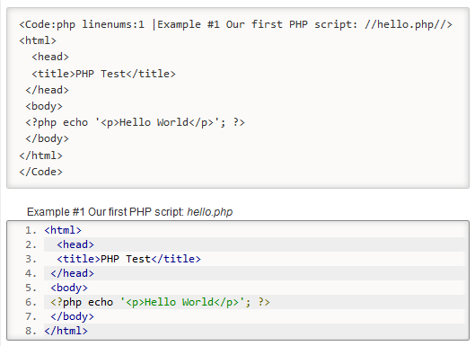

DokuWiki plugin Code Prettifier
===============================

syntax highlighting of source code snippets in wiki page, using [Javascript code prettifier](https://github.com/google/code-prettify) (former google-code-prettify).


Usage/Example
-------------

```
<Code:php linenums:1 |Example #1 Our first PHP script: //hello.php//>
<html>
  <head>
  <title>PHP Test</title>
 </head>
 <body>
 <?php echo '<p>Hello World</p>'; ?> 
 </body>
</html>
</Code>
```




----
Licensed under the GNU Public License (GPL) version 2

The [Javascript code prettifier](https://github.com/google/code-prettify), which was once known as "google-code-prettify", is a javascript module and CSS file that allows syntax highlighting of source code snippets in an html page. They are separetely licenced under the Apache License, Version 2.0

More information is available:
  * https://www.dokuwiki.org/plugin:codeprettify

(c) 2015-2019 Satoshi Sahara \<sahara.satoshi@gmail.com>
